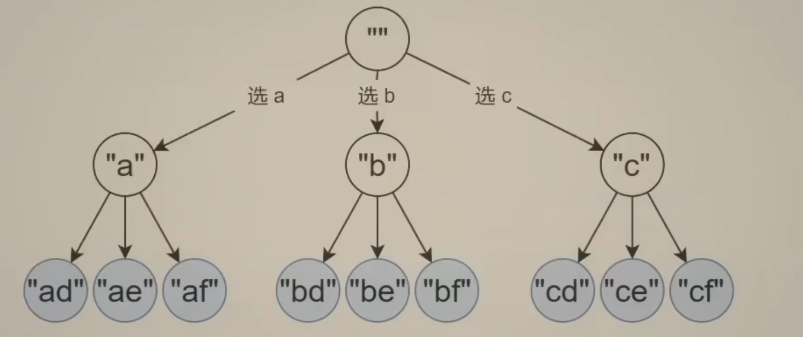
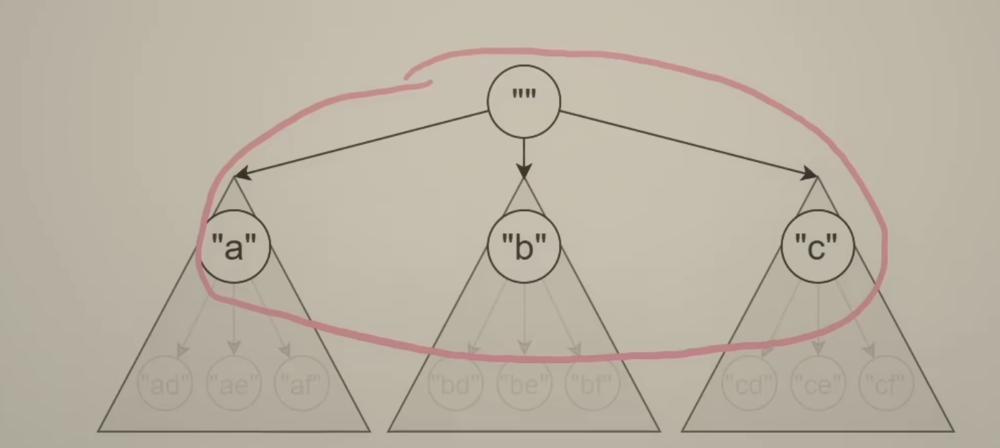

# Back-Track

首先我们明白一个逻辑意义：循环，是同一份代码的多次执行；递归，也是同一份代码的多次执行。

从这个角度来说，递归和循环是相似的

- 单纯的循环嵌套，表达能力是有限的 -> 原问题 + 子问题 相似可以用递归解决
- 回溯是一个**增量**构造答案的过程，这个过程通常使用递归实现，通过递归，实现了多重循环的效果

递归代码，如何思考，如何保证正确性

- 只要边界条件和非边界条件逻辑正确即可
- 其余逻辑的正确性通过交给数学归纳法来保证是数学自洽的

所以我们的编程重点应该放在递归转移的局部过程，而不用过分在意全局

所以有如下套路：回溯三问，用一个path数组记录路径上的字母

## 例题：17.电话号码组合

用来说明回溯三问（也是**动态规模的思考切入点**）

- 当前操作？枚举path[i]要填入的字母
- 子问题？构造字符串 >= i   的部分
- 下一个子问题？构造字符串 >= i+1的部分
  - dfs(i) -> dfs(i+1)

## 三种类型的题目

1. [子集型回溯](./subset/README.md)
1. [组合型回溯](./combination/README.md)
1. [排列型回溯](./permutation/README.md)

