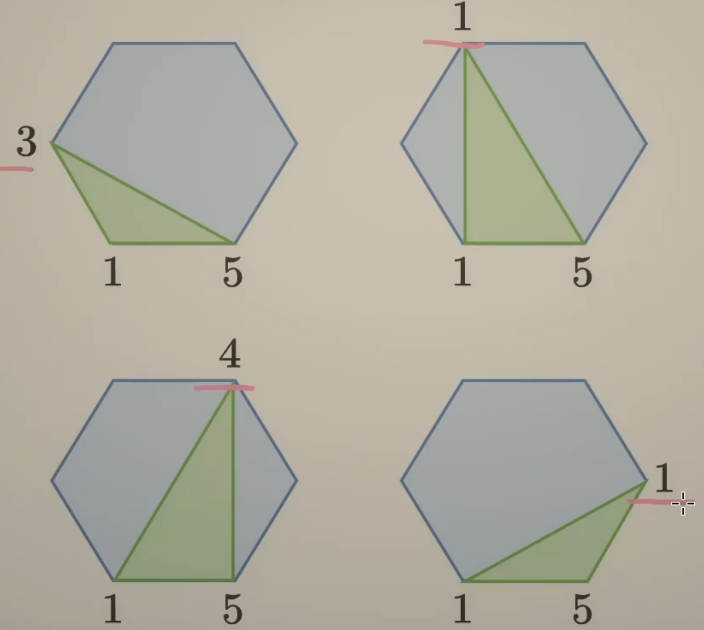
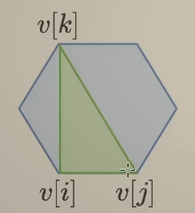

# 区间DP

1. 与线性DP的区别
    - 线性DP：一般是在数组的前缀或者后缀上转移
    - 区间DP：从小区间转移到大区间
2. 选或不选
    - 从两侧向内部**缩小**问题规模
    - 516. 最长回文子序列
3. 枚举选哪个
    - **分割**成多个规模更小的子问题
    - 1039. 多边形三角剖分的最低得分

## 516 最长回文子序列

s = eacbba

- 思路1：「转换」求s和s翻转后的LCS最长公共子序列
- 思路2：「选或不选」既然是子序列，本质上还是**选或不选**，题目是回文子序列，那么就是看第一个字母和最后一个字母选不选，从两侧向内缩小问题规模
    - 

这里展开的是思路2

- dfs(i,j) 表示s[i]到s[j]的最长回文子序列的长度

转移方程有

- dfs(i,j) =
    - dfs(i+1, j-1) s[i] == s[j]
    - max(dfs(i+1, j), dfs(i, j-1))  s[i] != s[j]

递归边界

- dfs(i, i) = 1
- dfs(i+1, i) = 0

递归入口

- dfs(0, n-1)

翻译成递推, f[i][j]

- 0 i > j
- 1 i == j
- f[i+1][j-1] + 2, s[i] == s[j]
- max(f[i+1][j], f[i][j-1]), s[i] != s[j]

循环顺序

- f[i]从f[i+1]转移过来，所以i要**倒序**枚举
- f[i][j]从f[i][j-1]转移过来，所以j要**正序**枚举

答案：f[0][n-1]

## 1039 多边形三角形剖分的最低得分

无论怎么去剖分，相邻两个顶点连线的边（比如1-5），**一定**在一个三角形中，枚举这个三角形，有四种选择

    

数组values简记为v

- 定义「从i到j」表示沿着边从顶点i到顶点j，再加上直接从j到i的这条边所组成的多边形

- 子问题：计算从i到j的最低得分
- 选择：枚举k
- 下一个子问题：计算从i到k的最低得分，计算从k到j的最低得分

所以有递归函数定义和转移

- dfs(i, j) 是「从i到j」这个多边形的最低得分
- dfs(i, j) = min( dfs(i,k) + dfs(k,j) + v[i] \* v[j] \* v[k] ), k in [i+1,j-1]
- 递归边界：dfs(i,i+1) = 0
- 递归入口：dfs(0,n-1)

翻译成递推

- f[i][j] =  min(f[i][k] + f[k][j] + v[i]\*v[j]\*v[k]), k in [i+1, j)
- 循环顺序
    - i < k, f[i] 从 f[k] 转移过来，大转小，所以i要倒序枚举
    - j > k, f[i][j] 从f[i][k] 转移过来，小转大，所以j要正序枚举
- 初始状态 f[i][j+1] = 0
- 最终答案 f[0][n-1]

## 练习

### 375 猜数字大小

[题解](https://leetcode.cn/problems/guess-number-higher-or-lower-ii/solutions/1098558/xiang-xi-fen-xi-cong-di-gui-dao-ji-yi-hu-9qun/)

看了题解，记录学习心得

1. 题目要求是确保获胜的最小现金数，有如下信息，首先，**1.我们要确保获胜**，所以考虑的应该是**最差情况**，比如[1,10]我们猜5直接猜中了，游戏结束，花费0，这不是最差情况，最差情况是我们一路猜下去，最后才猜到
2. f(i, j)表示[i,j]范围内确保胜利的最小金额，目标是计算f(1, n)
3. max  
    - 假设第一次猜的数字是x，并且猜错了，需要支付金额x，如果x大于答案，为了确保胜利还需要支付f(1, x-1)，如果x小于答案，为了确保胜利还需要支付f(x+1, n)
    - 然后题目要求我们确保获胜，要考虑最坏情况，所以二者选最大值
4. min
    - 为了将确保胜利的金额最小化，我们需要遍历1到n所有可能选择的x，使得f(1, n)最小，所以在所有可能的x中取一个min

### 132 分割回文串

[题解](https://leetcode.cn/problems/palindrome-partitioning-ii/solutions/641529/fen-ge-hui-wen-chuan-ii-by-leetcode-solu-norx/)

看了题解，自己的写法有超时了，整体思路没问题，但忽略了一些冗余情况，看了题解之后改进通过

### 3040 相同分数的最大操作数目

[题解](https://leetcode.cn/problems/maximum-number-of-operations-with-the-same-score-ii/solutions/2643756/qu-jian-dp-de-tao-lu-pythonjavacgo-by-en-nynz/)

自己做出来了，也看了题解学习

### 1312 回文串

经典题目，背诵

### 1770 hard

不会做，先pass

### 1547, 1000

不会做，后面回来再做，应该不会考