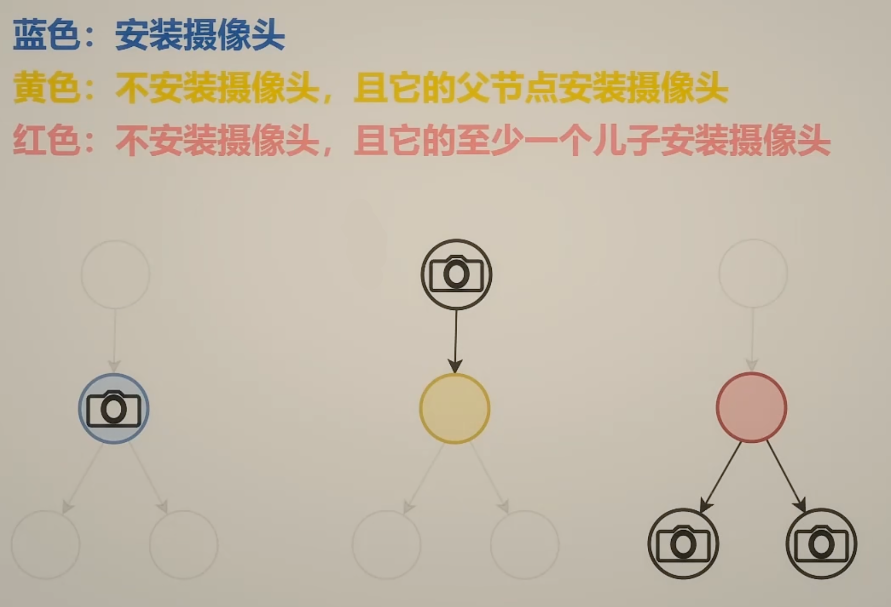
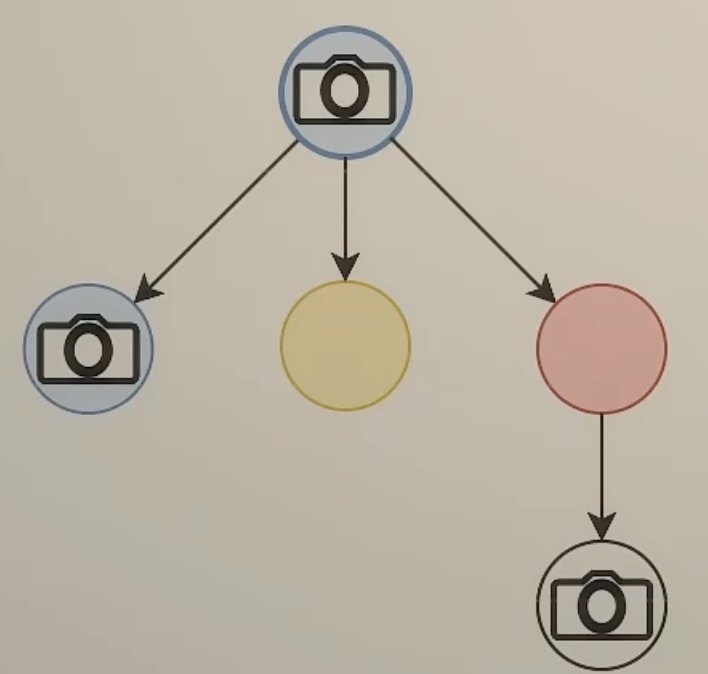
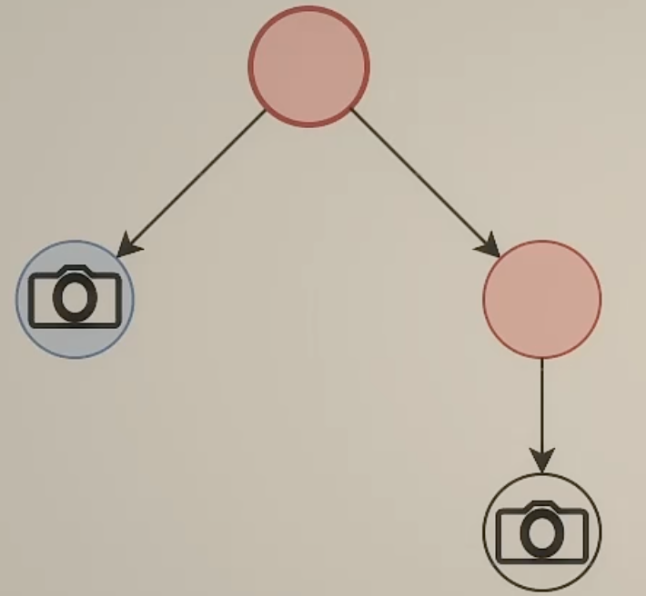

# 树形DP

## ① 树的直径类题目

### 二叉树

复习：104 二叉树的最大深度

- 思考整棵树和左右子树的关系
- 原问题：整棵树
- 子问题：左子树、右子树
- 整棵树的最大深度 = max（左右子树的最大深度）+ 1

问题：直径和最大深度是否有联系呢？首先从543题来看，**直径**是树上的一条最长的路径，路径长度定义为边的数目

- 换个角度看直径：从一个叶子出发向上，在某个节点「拐弯」，向下到达另一个叶子。得到了两条**链**拼起来的路径（也可能只有一条链）
- 可以发现：直径某种意义上和两个最大深度建立起了关系

所以可以有如下处理**直径**问题的算法

- 遍历二叉树，在计算最长**链**的同时，顺带把直径计算出来
- 在当前节点「拐弯」的直径长度 = 左子树最长链 + 右子树最长链 + 2
- 返回给父节点的是：**当前节点为根的子树的最长链** = max(左子树最长链，右子树最长链) + 1
- 相关题目 
  - **边权型**：543 二叉树的直径

以及
- 遍历二叉树，在计算**链**和的同时，更新答案的最大值
- 在当前节点「拐弯」的最大**路径**和 = 左子树最大**链**和 + 右子树最大**链**和 + 当前节点值
- 返回给父节点的是：max(左子树最大链和， 右子树最大链和) + 当前节点值
    - 如果这个值是负数，则返回0
- 相关题目
    - **点权型**：124 二叉树中的最大路径和

### 一般树

一般树的性质

- 我们定义x和y结点间有边相连，称为邻居
- 二叉树最多三个邻居：左孩子、右孩子、父节点
- 一般树中邻居的个数就不定了，需要for循环挨个遍历他的邻居

那么如何计算一般树的直径呢？

- 思路1：遍历x的子树，把最长链的长度都存到一个列表中，排序，取最大的两个
- 思路2：遍历x的子树的同时求最长+次长

如何一次遍历找到最长+次长？
- 如果次长在前面，最长在后面
    - 那么遍历到**最长**的时候就能算出最长+次长
- 如果最长在前面，次长在后面
    - 那么遍历到**次长**的时候就能算出最长+次长
- 所以：遍历的时候维护最长长度，一定会在遍历到某个子树的时候算出最长+次长
- 相关题目
    - 2246 相邻字符不同的最长路径
    - 1245 树的直径，这道题就是2246没有相邻节点的限制，求树的直径上点的个数

### 练习题

1. 687 最长同值路径
2. 1617 统计子树中城市之间最大距离 看了题解
3. 2538 最大价值和与最小价值和的差值 看了题解
4. 3203 合并两棵树后的最小直径 看了题解

## ② 打家劫舍 最大独立集

打家劫舍

- 每个节点都选和不选两种可能，看做两种状态，在节点间进行状态转移
- 子问题：当前节点**选或不选**，价值的最大值
    - 选当前节点，左右孩子都不能选
    - 不选当前节点，左右孩子可选可不选
- 提炼状态
    - 选当前节点时，价值的最大值（以当前节点为根的**子树**最大点权和）
    - 不选当前节点时，价值的最大值（以当前节点为根的**子树**最大点权和）
- 转移方程
    - 选 = 左不选 + 右不选 + 当前节点值
    - 不选 = max(左选，左不选) + max(右选，右不选)
- 最终答案
    - max(根选，根不选)

没有上司的舞会，上述类似的场景，打家劫舍是二叉树，推广到一般树上

- 选 = sum(不选子节点) + 当前节点值
- 不选 = sum(max(选子节点，不选子节点))

总结

- **树上的最大独立集**
    - 二叉树：337 打家劫舍
    - 一般树：没有上司的舞会
- **最大独立集**需要从图中选择尽量多的点，使得这些点互不相邻。
    - 变形：最大化点权之和（最大独立集就是点权都是1的特殊情况）
- **树和子树**的关系，类似于**原问题和子问题**的关系
    - 所以树天然地具有递归的特点
- **如何由子问题算出原问题**，是思考树形DP的出发点。
    - 常见套路和启发式思考的切入点依旧是
        1. 选哪个
        2. 选或不选

### 练习题
- 洛谷 没有上司的舞会
- 1377 t秒后青蛙的位置 看了[题解](https://leetcode.cn/problems/frog-position-after-t-seconds/solutions/2281408/dfs-ji-yi-ci-you-qu-de-hack-by-endlessch-jtsr/)
- 2467 树上最大得分和路径
- 2646 最小化旅行的价格总和

## ③ 最小支配集 监控二叉树

有几种方法可以监控一个节点？

从选或不选切入思考：

- 选：在这个节点装摄像头
- 不选：在父节点装摄像头
- 不选：在至少一个儿子节点装摄像头

例子：比如根节点不装摄像头，那么他的孩子节点至少有一个要装摄像头，否则根节点就无人监控了

- 蓝色：安装摄像头
- 黄色：不安装摄像头，父节点安装（父亲管）
- 红色：不安装摄像头，至少一个儿子安装摄像头（儿子管）

讨论子树根节点的颜色，对应需要最少得摄像头

- 蓝色时，监控这个子树最少需要多少摄像头
- 黄色时，监控这个子树最少需要多少摄像头
- 红色时，监控这个子树最少需要多少摄像头

- 蓝色节点的儿子是哪种颜色都可以，因为肯定被父亲监控了
    - 蓝色 = min(左蓝，左黄，左红) + min(右蓝，右黄，右红) + 1

- 黄色节点的儿子不可能是黄色，黄色是父节点装，儿子不装，所以儿子肯定不是黄色
    - 黄色 = min(左蓝，左红) + min(右蓝，右红)

- 红色节点的儿子不可能是黄色，黄色是父节点装，儿子不装，所以儿子肯定不是黄色，且至少有一个儿子是蓝色
    - 红色 = min(左蓝 + 右红，左红+右蓝, 左蓝+右蓝) -> 可简化

最终整棵树的答案

- 二叉树的根节点，没有父节点，所以不可能是黄色，只能是蓝色或者红色
- 所以最终答案 = min(根节点蓝色， 根节点红色)

递归边界

- 空节点不能装摄像头：蓝色为无穷，表示不合法
- 空节点不需要被监控：黄色和红色都是0

题目变体
- 变体1：在节点x装摄像头，需要花费cost[x]，求监控所有节点的最小花费
    - 其实相当于每个节点加了权重val，例题中相当于节点权为1
- 变体2：如果一个红色节点有3个儿子、4个儿子...呢？ -> 洛谷保安站岗问题
    - 红色节点儿子不可能是黄色且**至少要有一个蓝色**，那么比如3个儿子，那么每个节点都是红蓝二选一，8种情况，4个儿子就是16种情况，然后至少有一个蓝色，所以除去全红的情况，就是7种和15种情况，那这个max(...)很长很复杂，需要化简红色节点的情况
        - 红色 = min(蓝1 + 蓝2 + 蓝3，蓝1 + 蓝2 + 红3， ... ， 7种排列组合)
    - 由于至少要有一个蓝色儿子，那么另一种表达式
        - 红色 = min（蓝1，红1） + min（蓝2， 红2） + min（蓝3，红3）
    - 上下两个式子什么情况下会不等？
        - 答案：红色都比蓝色小的情况下，选到了全红的case
        - 这个时候，我们需要把其中一个红色给变成蓝色，所以要选（蓝色-红色）差值最小的那个
    - 所以新的转移公式
        - 黄色 = min（蓝1， 红1） + min（蓝2， 红2） + min（蓝3， 红3）
        - 红色 = 黄色 + max（0，min（蓝1-红1，蓝2-红2，蓝3-红3））
        - 蓝色 = min（蓝1， 黄1）+ min（蓝2，黄2） + min（蓝3，黄3） + cost[x]
            - 红色的公式等于黄色加一个大于等于0的数，也就是说红色一定大于等于黄色
            - 所以蓝色的转移表达式的min中，红色可以被省略掉了
    
