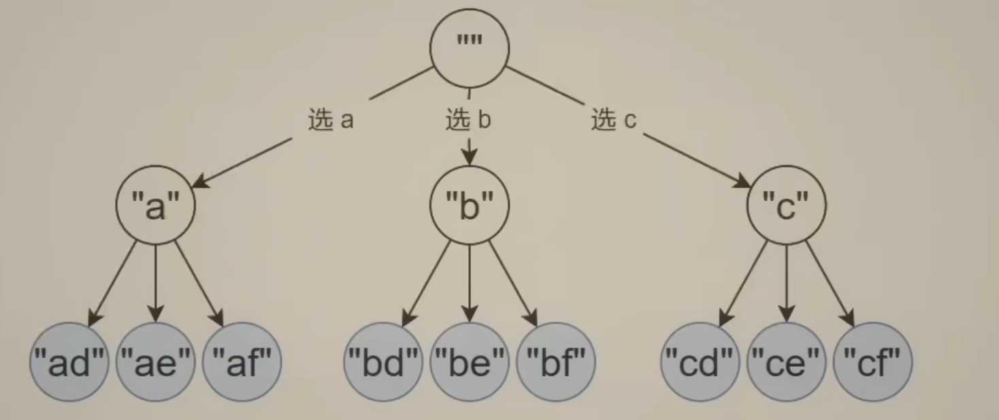
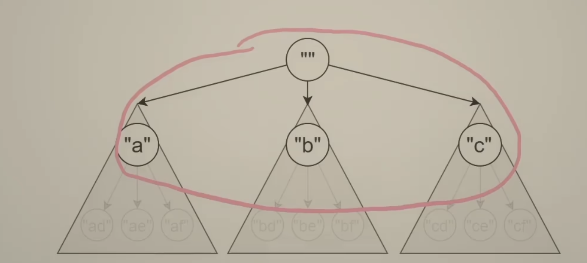
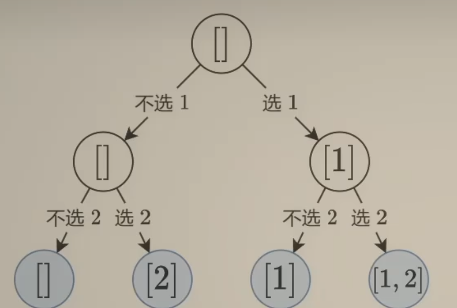
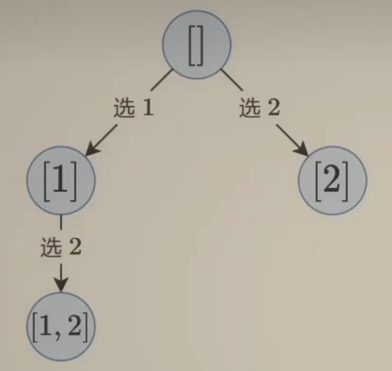
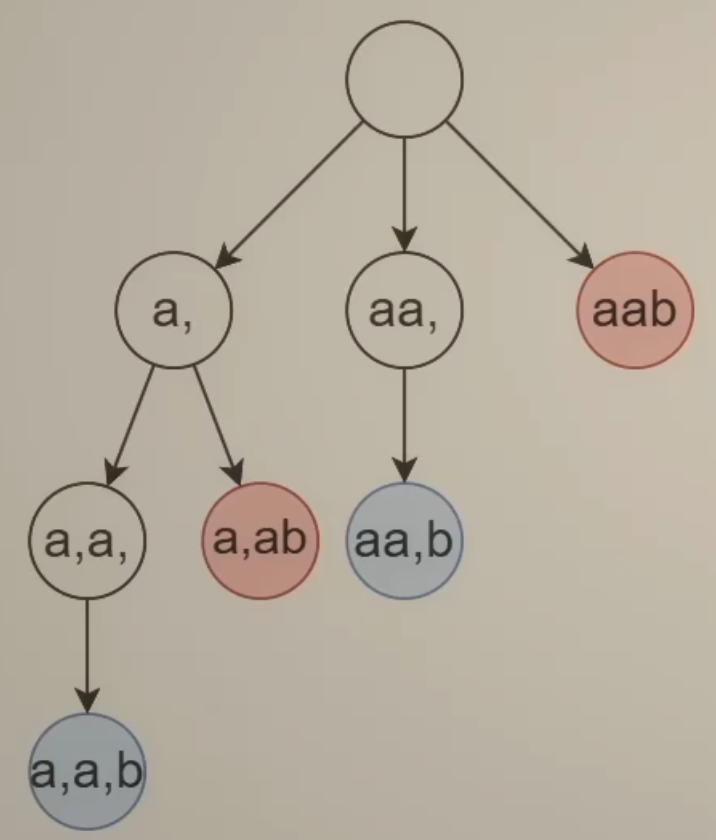

# Back-Track

首先我们明白一个逻辑意义：循环，是同一份代码的多次执行；递归，也是同一份代码的多次执行。

从这个角度来说，递归和循环是相似的

- 单纯的循环嵌套，表达能力是有限的 -> 原问题 + 子问题 相似可以用递归解决
- 回溯是一个**增量**构造答案的过程，这个过程通常使用递归实现，通过递归，实现了多重循环的效果

递归代码，如何思考，如何保证正确性

- 只要边界条件和非边界条件逻辑正确即可
- 其余逻辑的正确性通过交给数学归纳法来保证是数学自洽的

所以我们的编程重点应该放在递归转移的局部过程，而不用过分在意全局

所以有如下套路：回溯三问，用一个path数组记录路径上的字母

## 例题：17.电话号码组合

用来说明回溯三问（也是**动态规模的思考切入点**）

- 当前操作？枚举path[i]要填入的字母
- 子问题？构造字符串 >= i   的部分
- 下一个子问题？构造字符串 >= i+1的部分
  - dfs(i) -> dfs(i+1)

## 子集型回溯

### 78.子集问题回溯，每个元素都可以**选/不选**

- 站在**输入**的视角：选或者不选当前数字
  - 每个数可以在子集中，也可以不在子集中（选和不选）
  - 叶子是答案
  - 回溯三问：
    - 当前操作？枚举第i个数选不选
    - 子问题？从下标>=i的数字中构造子集
    - 下一个子问题？从下标>=i+1的数字中构造子集
  - 递归链 = dfs(i) -> dfs(i+1)

- 站在**答案**的角度思考：每次必须选一个，但是要决定选哪个
  - 枚举第一个数选谁？枚举第二个数选谁？-> 多层问题，循环嵌套 + 原问题子问题，递归 = 回溯
  - 每个节点都是一个答案
  - 回溯三问：
    - 当前操作？枚举下标 j>=i 的数字，加入path
    - 子问题？从下标>=i的数字中构造子集
    - 下一个子问题？从下标>=j+1的数字中构造子集
  - 递归链 = dfs(i) -> j = i, dfs(j+1),dfs(j+2),dfs(j+...),dfs(n-1)

- 未来补充：0-1背包问题也可以看做是一种子集型回溯
  

### 131.分割回文串，我们在每个字母之间加入一个逗号，这个问题就转化为了，每个逗号**选/不选**的子集问题了

- 类似于78的思路，多了一个回文的条件判断

- 站在**答案**的角度
  - 枚举回文串的位置(也就是回文串结束的位置)
  - 叶子是答案
  - 回溯三问
    - 当前操作：选择回文串s[i..j]，加入path
    - 子问题？从>=i的后缀中构造回文分割
    - 下一个子问题？从>=j+1的后缀中构造回文分割
  - 递归链 = dfs(i) -> dfs(i+1), dfs(i+2),...,dfs(n)
- 站在**输入**的角度
  - 是否要枚举s[i]作为从start开始的分割出的子串的最后一个字符
  - 叶子是答案
  - 回溯三问
    - 当前操作：s[i]选或者不选作为最后一个字符，加入path
    - 子问题？从start开始，i结束构造回分割
    - 下一个子问题？从下标>=i+1的后缀中继续构造回文分割

## 组合型回溯

- 最直接的组合问题，77题，其实是子集问题的特例：给定了某个长度，对应回溯树的某一行，就是组合
  - 所以组合问题可以对子集问题的回溯树做剪枝，大于给定长度的那一行，没必要继续回溯了

## 排列型回溯

- 为什么N-皇后问题属于排列问题呢，因为比如第i行皇后的列号是col[i]，那么col一定是[0, N-1]的一个排列
  - 只不过这个排列要满足两个对角线的独特条件
  - 所以皇后问题就转换为了所有的排列中，找出不触发对角线冲突的排列