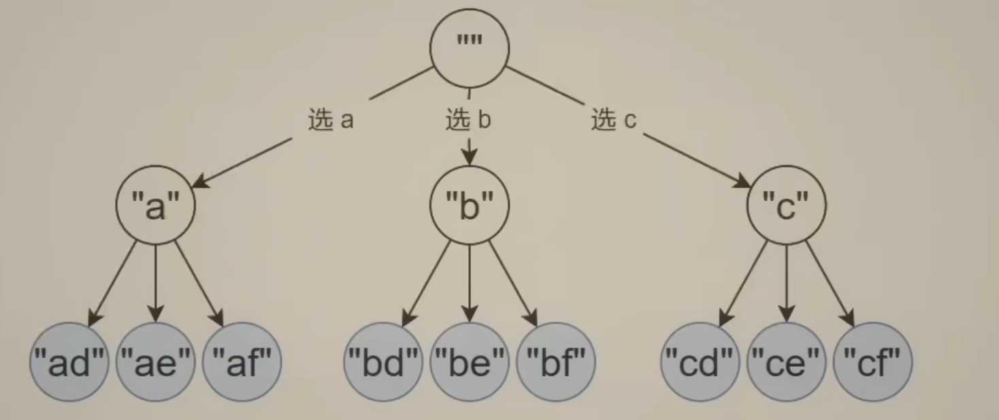
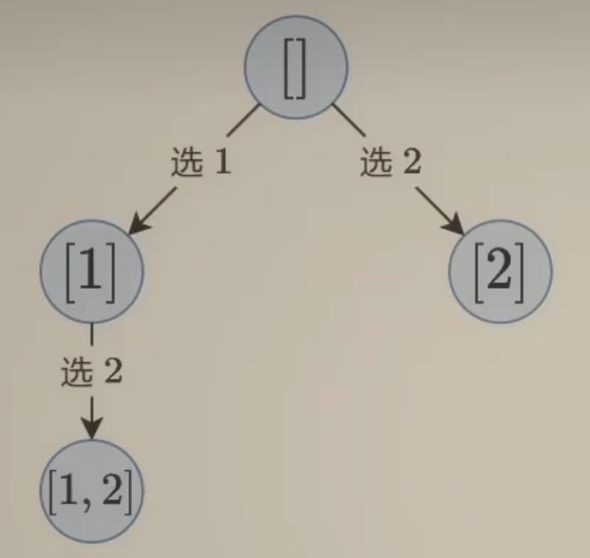
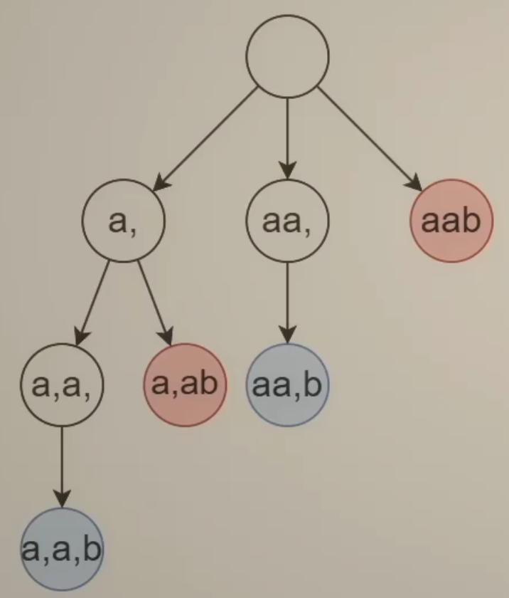

# Back-Track

- 单纯的循环嵌套，表达能力是有限的 -> 原问题 + 子问题 相似可以用递归解决
- 回溯是一个**增量**构造答案的过程，这个过程通常使用递归实现，通过递归，实现了多重循环的效果

递归代码，如何思考，如何保证正确性

- 只要边界条件和非边界条件逻辑正确即可
- 其余逻辑交给数学归纳法就行了

所以有如下套路：回溯三问，用一个path数组记录路径上的字母

17.电话号码组合

- 当前操作？枚举path[i]要填入的字母
- 子问题？构造字符串 >= i   的部分
- 下一个子问题？构造字符串 >= i+1的部分
  - backtrack(i) -> backtrack(i+1)

## 子集型回溯

78.子集问题回溯，每个元素都可以**选/不选**

- 站在**输入**的视角
  - 每个数可以在子集中，也可以不在子集中（选和不选）
  - 叶子是答案
  - 回溯三问：
    - 当前操作？枚举第start个数选不选
    - 子问题？从下标>=start的数字中构造子集
    - 下一个子问题？从下标>=start+1的数字中构造子集
    - 即dfs(i) -> dfs(i+1)
- 站在**答案**的角度思考：
  - 枚举第一个数选谁？枚举第二个数选谁？-> 多层问题，循环嵌套 + 原问题子问题，递归 = 回溯
  - 每个节点都是一个答案
  - 回溯三问：
    - 当前操作？枚举下标 i>=start 的数字，加入path
    - 子问题？从下标>=start的数字中构造子集
    - 下一个子问题？从下标>=i+1的数字中构造子集
    - 即dfs(start) -> i = start, dfs(i+1),dfs(i+2),dfs(i+...),dfs(n-1)

131.分割回文串，我们在每个字母之间加入一个逗号，这个问题就转化为了，每个逗号**选/不选**的子集问题了

- 类似于78的思路，只不过多了一个回文的条件判断
- 站在了答案的角度
  - 枚举回文串的位置(也就是回文串结束的位置)
  - 叶子是答案
  - 回溯三问
    - 当前操作：选择回文串s[start..i]，加入path
    - 子问题？从>=start的后缀中构造回文分割
    - 下一个子问题？从>=i+1的后缀中构造回文分割
    - dfs(start) -> dfs(i+1), dfs(i+2),...,dfs(n)
- 站在输入的角度
  - 枚举逗号的位置（选或者不选逗号）
  - 叶子是答案
  - 回溯三问
    - 留作联系

## 组合型回溯

