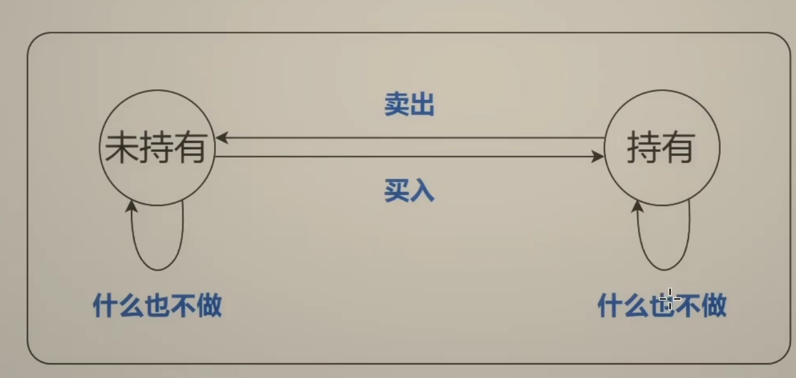
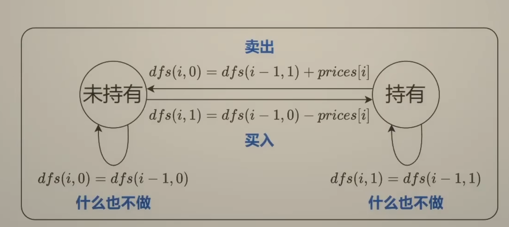
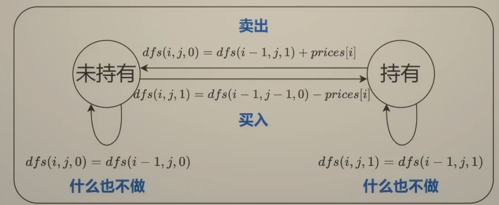
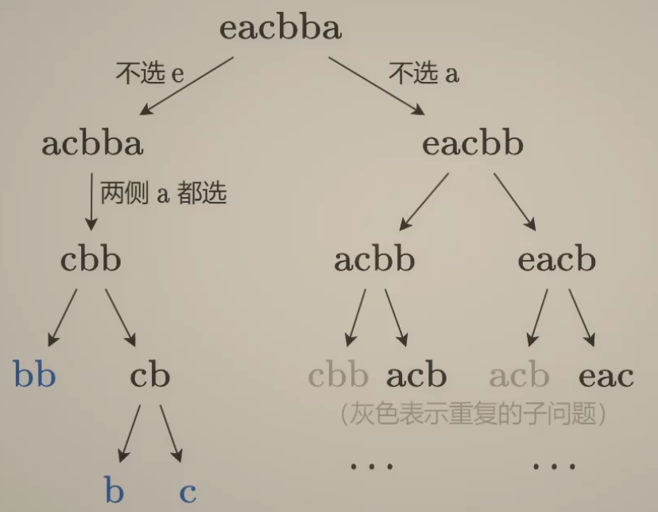
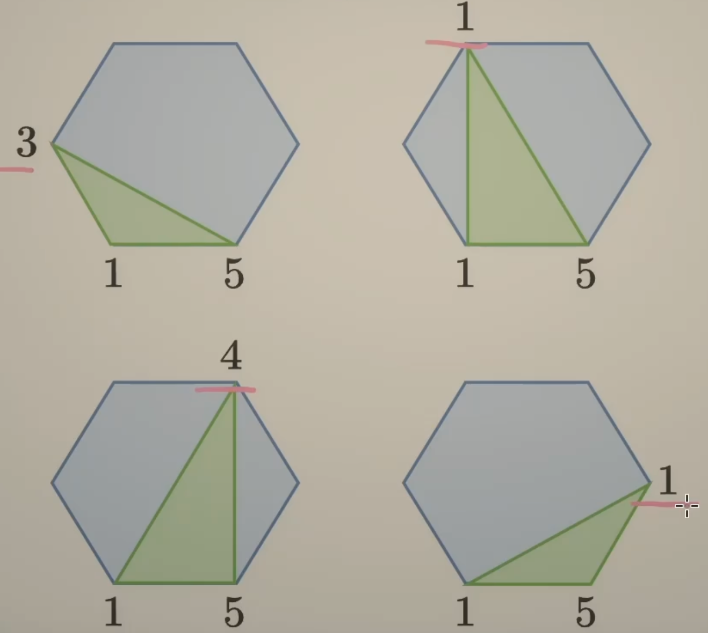
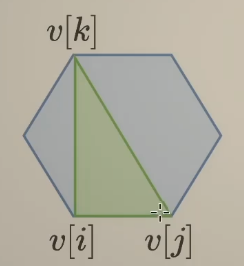

# DP

新手的三步

- 思考回溯怎么写
  - 入参和返回值
  - 递归到哪里
  - 递归边界和入口
- 改成记忆化搜索
- 1:1 翻译成递推式

状态定义？状态转移方程？该如何思考

利用回溯的启发式思路：**选或不选/选哪个**，来帮助思考状态定义和状态转移方程

## 选或不选

对应的常见dp题型是：0-1背包，完全背包问题

0-1 背包：有n个物品，第i个物品体积w[i]，价值v[i]，每个物品至多选一个，背包容量为capacity，求不超过capacity的最大价值和

- 回溯三问
  - 当前操作？枚举第i个物品选或不选：不选，剩余容量不变；选，剩余容量减少w[i]
  - 子问题？在剩余容量为c时，从前i个物品中得到的最大价值和
  - 下一个子问题？分类讨论
    - 不选：在剩余容量为c时，从前i—1个物品中得到的最大价值和
    - 选：在剩余容量为C一w[i]时，从前**i-1**个物品中得到的最大价值和
  - dfs(i, c) = max( dfs(i-1, c), dfs(i-1, c-w[i]) + v[i] )
- 常见变形
  - 至多装capacity，求方案数/最大价值和
  - 恰好装capacity，求方案数/最大/最小价值和
  - 至少装capacity，求方案数/最少价值和
- 494题：dfs(i, c) = dfs(i-1, c) + dfs(i-1, c-w[i])
  - 递推
    - dp[i]\[c\] = dp[i-1]\[c\] + dp[i-1][c-w[i]]
    - dp[i+1]\[c\] = dp[i]\[c\] + dp[i][c-w[i]]

完全背包：有n种物品，第i个物品体积w[i]，价值v[i]，每个物品无限次重复选，背包容量为capacity，求不超过capacity的最大价值和

- 回溯三问
  - 当前操作？枚举第i种物品选或不选：不选，剩余容量不变；选，剩余容量减少w[i]
  - 子问题？在剩余容量为c时，从前i种物品中得到的最大价值和
  - 下一个子问题？分类讨论
    - 不选：在剩余容量为c时，从前i—1种物品中得到的最大价值和
    - 选：在剩余容量为C一w[i]时，从前**i**种物品中得到的最大价值和
  - dfs(i, c) = max( dfs(i-1, c), dfs(i-1, c-w[i]) + v[i] )
- 常见变形
  - 至多装capacity，求方案数/最大价值和
  - 恰好装capacity，求方案数/最大/最小价值和
  - 至少装capacity，求方案数/最少价值和
- 322.题：dfs(i, c) = min(dfs(i-1, c), dfs(i-1, c-w[i])+1)
  - 递推
    - dp[i]\[c\] = min(dp[i-1]\[c\], dp[i-1][c-w[i]]+1)
    - dp[i+1]\[c\] = min(dp[i]\[c\], dp[i][c-w[i]]+1)

## 选哪个

- 像322题，还可以用：选哪个的视角来进行dp，留作练习

## 边界条件总结

- [视频评论区](https://www.bilibili.com/video/BV16Y411v7Y6)

## 线性DP Sub-Sequence 子序列问题（不连续）

### 2个字符串

#### 1143 最长公共子序列

启发思路：子序列本质就是**选或不选**，考虑最后一对字母记作x和y

- 不选x不选y
- 不选x选y
- 选x不选y
- 选x选y

一般化后，回溯三问

- 当前操作？s[i]和t[j]选或不选
- 子问题？s[...i]和t[...j]的LCS长度，[...k]符号表示前k个字母
- 下一个子问题？
  - s[...i-1]和t[...j-1]的LCS长度
  - s[...i-1]和t[...j]的LCS长度
  - s[...i]和t[...j-1]的LCS长度
  - 这里有一个小细节（都选和都不选对应的子问题是一样的）：只有s[i] == t[j]时候才能都选

所以有递归函数（状态转移）

- dfs(i, j) = max( choice1, choice2, choice3)
  - choice1 = dfs(i-1, j)
  - choice2 = dfs(i, j-1)
  - choice3 = dfs(i-1, j-1) + (s[i] == t[j])

不能忽略的两个问题

- s[i] == t[j]时，需要考虑dfs(i-1, j)和dfs(i, j-1)么：不需要
  - 利用反证法：dfs(i, j) = max(dfs(i-1, j-1) + 1, dfs(i-1, j), dfs(i, j-1))
  - 记 x = dfs(i-1, j-1)，假设dfs(i-1, j) > x + 1，我们max要取最大的
  - dfs(i-1,j)> x+1, 假设s[i-2]和t[j]匹配了，那么剩余串s[...i-3,i-1]和t[...j-1]的LCS 一定是 > x
    - 因为如果<= x，那么fds(i-1, j) 至多 == x + 1，矛盾了
  - 而又s[...i-3,i-1]和t[...j-1]是s[...i-1],t[...j-1]的子情况，其LCS肯定小于等于更长的父情况，也就是 <= x
  - 那么可以发现 s[...i-3,i-1]和t[...j-1]又 > x, 又 <= x，矛盾
  - 说明原假设不成立，所以dfs(i-1, j) <= x + 1(dfs(i, j-1)同理)
  - 所以s[i] == t[j] 时候 dfs(i, j) = dfs(i-1, j-1) + 1，不用再max三个选择了

- s[i] != t[j]时，需要考虑dfs(i-1, j-1)么：不需要
  - 这个好理解，是被包含的，dfs(i-1,j)/dfs(i,j-1) >= dfs(i-1,j-1)
  
  ```plain
    i,j -> i-1, j -> i-1, j-1
        \            /
         -> i, j-1 ->
  ```

  - 所以 s[i] != t[j] 时候 dfs(i, j) = max( dfs(i-1, j), dfs(i, j-1) ) max两个选择即可

所以最终递归函数（状态转移）

- dfs(i, j)
  - = dfs(i-1, j-1) + 1  (s[i] == t[j])
  - = max(dfs(i-1, j), dfs(i, j-1))  (s[i] != t[j])
- f[i]\[j]
  - = f[i-1]\[j-1] + 1 (s[i] == t[j])
  - = max(f\[i-1][j], f[i]\[j-1])  (s[i] != t[j])
- 或f[i+1]\[j+1]
  - = f[i]\[j] + 1 (s[i] == t[j])
  - = max(f\[i+1][j], f[i]\[j+1])  (s[i] != t[j])

#### 72 编辑距离

两个字符串s 和 t，要把s改成t，有三种操作：插入、删除、替换

- 核心：**等价转换**，注意固定视角，三种操作针对的都是s[i]
  - s[i] == t[j]
    - dfs(i-1, j-1) 同样不需要考虑另外两种，证明方式同1143
  - s[i] != t[j]
    - 删除：很简单，去掉s[i] -> dfs(i-1, j)
    - 插入：在s[i]这插一个t[j]，相当于把t[j]去掉了，s[i]接着用 -> dfs(i, j-1)
    - 替换：把s[i]换成t[j]，相当于把s[i]和t[j]同时去掉 -> dfs(i-1, j-1)
    - 然后min(三个选择)

所以递归函数（状态转移）

- dfs(i, j)
  - = dfs(i-1, j-1)  (s[i] == t[j])
  - = min(dfs(i-1, j), dfs(i, j-1), dfs(i-1, j-1) ) + 1  (s[i] != t[j])
- f[i]\[j]
  - = f[i-1]\[j-1] + 1 (s[i] == t[j])
  - = max(f\[i-1][j], f[i]\[j-1], f[i-1]\[j-1]) + 1  (s[i] != t[j])
- 或f[i+1]\[j+1]
  - = f[i]\[j] + 1 (s[i] == t[j])
  - = max(f\[i+1][j], f[i]\[j+1], f[i]\[j]) + 1  (s[i] != t[j])

### 数组

#### 300 最长递增子序列

子序列，本质上是数组的一个子集，那么可以用子集型回溯来思考，有两种思路

eg: [1,6,7,2,4,5]

- 思路1：选或不选，为了比大小，需要知道上一个选的数字
  - 从后往前遍历，假设3是子序列的最后一个数字，选不选，需要前面数字和3比大小，所以除了当前下标以外，还需要知道上一个数字的下标
- 思路2：枚举选哪个，比较当前选的数字和下一个选的数字
  - 可以直接枚举前面的比3小的数，当做子序列的倒数第二个数，那么只需要知道当前所选数字的下标，这种更加好表达，只需要一个参数，思路1需要两个参数

启发思路

- 枚举nums[i]作为LIS的末尾元素，那么需要枚举nums[j]作为LIS的倒数第二个元素，其中j < i, nums[j] < nums[i]

回溯三问

- 子问题？以nums[i]为结尾的LIS长度
- 当前操作？枚举nums[j]
- 下一个子问题？以nums[j]结尾的LIS长度

递归函数（递推表达式）

- dfs(i) = max{dfs(j)} + 1  枚举j in [0...i-1], j < i, nums[j] < nums[i]
- f[i] = max{f[j]} + 1 枚举j in [0...i-1], j < i, nums[j] < nums[i]

有一个特殊的思路3

- nums[i]的LIS等价于nums与排序后去重的nums的LCS（最长公共子序列)
- nums = [1,3,3,2,4]
- 排序后去重 nums = [1,2,3,4]
- LCS = [1,3,4], [1,2,4]

如何继续优化时间复杂度，思路4

- 动态规划的一个优化的进阶技巧：**交换状态与状态值**
- f[i] = **末尾元素**是nums[i]对应的LIS**长度**
- 那么对应的交换就是：g[i]表示**长度**为i+1的IS**末尾元素**的最小值
- eg: nums = [1,6,7,2,4,5,3] 从左到右遍历数组
  - g = [1], i=0，此时只有1，那么长度为1的IS末尾元素最小值是1
  - g = [1,6]  i=1，那么长度为2的IS末尾最小元素是6[1,6]
  - g = [1,6,7] i=2，遇到7，还大，得到长度为3的IS末尾最小元素是7[1,6,7]
  - g = [1,2,7] i=4，2比6小，更新6[1,2]
  - g = [1,2,4] i=5，4比7小[1,2,4]更新4
  - g = [1,2,4,5] i=6，长度为4的IS末尾元素最小值是5
  - g = [1,2,3,5] i=7，3比4小[1,2,3]更新3
- 这种思路没有重叠子问题，所以不能算是动态规划问题，而是成为了一个贪心问题，具体细节可看[视频](https://www.bilibili.com/video/BV1ub411Q7sB/?spm_id_from=333.788&vd_source=e20baca73cb83dab77dad1a2762b5a03)

## 状态机DP

### 122 买卖股票的最佳时机 II（不限制交易次数）

prices = [7,1,5,3,6,4]

- 启发思路：最后一天发生了什么？
  - 从第0天开始到第5天结束的利润 = 0天开始到第4天结束的利润 + 第五天的利润
    - 第五天的利润：无操作，买入，卖出 -> 0 或者 -4 或者 +4
    - 注意这里的卖出+4，是不考虑前几天买入时候的成本的，比如说倒数第二天6买入的，那么会记录在那天对应的买入操作的-6
    - 也就是每天只考虑当天的金钱变动，这样保证的完整性和正确性
关键词：天数、是否持有股票

- 子问题？到第i天结束，持有/未持有股票的最大利润
- 当前操作：
- 下一个子问题？到第i-1天结束，持有/未持有股票的最大利润

所以可以定义dfs函数的语义

- dfs(i,0):表示第i天**结束**，未持有股票的最大利润
- dfs(i,1):表示第i天**结束**，持有股票的最大利润表示
- 由于i-1天的结束就是第i天的开始（这个等价转换关系经常使用，比较重要），dfs(i-1,·) 也表示到第i天**开始**的最大利润

所以递归函数（状态转移）有

- dfs(i,0) = max(dfs(i-1, 0), dfs(i-1, 1) + prices[i])
- dfs(i,1) = max(dfs(i-1, 1), dfs(i-1, 0) - prices[i])

递归边界

- dfs(-1, 0) = 0    第0天开始未持有股票(i-1天的结束就是第i天的开始)
- dfs(-1, 1) = -inf 第0天开始不可能持有股票(i-1天的结束就是第i天的开始)

递归入口

- max(dfs(n-1, 0), dfs(n-1, 1)) = dfs(n-1, 0) 最后一天肯定是要手里股票卖出去了钱更多

翻译成递推

- f\[i][0] = max(f\[i-1][0], f\[i-1][1] + prices[i])
- f\[i][1] = max(f\[i-1][1], f\[i-1][0] - prices[i])

因为数组无法表示f[-1]，所以插入一个状态

- f\[0][0] = 0, f\[0][1] = -inf
- f\[i+1][0] = max(f\[i][0], f\[i][1] + prices[i])
- f\[i+1][1] = max(f\[i][1], f\[i][0] - prices[i])
- 答案为f\[n][0];

#### 309 买卖税票的最佳时机含冷冻期

类似于打家劫舍，如果选i，则i-1不能选，递归到i-2，这里有点同理，卖出股票，则第二天无法买入股票

- 那么对于i，直接从i-2进行状态转就行

#### 714 买卖股票的最佳时机含手续费

- 相当于 - prices[i]的时候 多减去一个手续费，比较简单的变体

### 188 买卖股票的最佳时机 IV （至多交易k次）

- 定义 dfs(i,j,0) 表示 第i天**结束**时完成**至多**j笔交易，未持有股票的最大利润
- 定义 dfs(i,j,1) 表示 第i天**结束**时完成**至多**j笔交易，持有股票的最大利润
- 注意是：**至多**，不是恰好

所以递归函数

- dfs(i,j,0) = max(dfs(i-1,j,0), dfs(i-1,j,1) + prices[i])
- dfs(i,j,1) = max(dfs(i-1,j,1), dfs(i-1,j-1,0) - prices[i])

递归边界

- dfs(·,-1,·) = -inf  任何情况下，j都不应该为负
- dfs(-1,j,0) = 0     第0天**开始**未持有股票，利润为0
- dfs(-1,j,1) = -inf  第0天**开始**不可能持有股票

递归入口

- 同上面一样的理解，不需要取max，肯定是不持有股票更大：dfs(n-1,k,0)

翻译成递推

- f\[i]\[j]\[0] = max(f\[i-1]\[j]\[0\], f\[i-1]\[j\]\[1\] + prices[i])
- f\[i]\[j]\[1] = max(f\[i-1]\[j]\[1\], f\[i-1]\[j-1\]\[0\] - prices[i])

这样无法表示f\[-1\]\[·\][·\]f\[·\]\[-1\]\[·\]

最终的递推式

- f\[·\][0]\[·\] = -inf
- f\[0\][j]\[0\] = 0  j >= 1
- f\[0\][j]\[1] = -inf  j >= 1
- f\[i+1\][j]\[0\] = max(f\[i\][j]\[0\], f\[i][j]\[1\] + prices[i])
- f\[i+1\][j]\[1\] = max(f\[i\][j]\[0\], f\[i][j]\[0\] - prices[i])
- ans = f\[n\][k+1]\[0\]

#### 两个变形问题：恰好/至少交易k次

要怎么初始化？

- 恰好：f\[0\][1]\[0\] = 0, 其余 = -inf
  - 注意前面塞了个状态，f\[0\][1]才是恰好完成0次的状态
- 至少：f\[i\][-1]\[·\] 等价于 f\[i\][0]\[·\]
  - 所以每个f[i]的最前面不需要插入状态
  - 「至少0次」等价于「可以无限次交易」
  - 所以f\[i\][0]\[·\]就是无限次交易下的最大利润，转移方程也一样
  - 转移方程
    - f\[0\][0]\[0\] = 0
    - f\[i+1\][0]\[0\] = max(f\[i\][0]\[0\], f\[i][0]\[1\] + prices[i])
    - f\[i+1\][0]\[1\] = max(f\[i\][0]\[1\], f\[i][0]\[0\] - prices[i])

- k=1 121 买卖股票的最佳时机
- k=2 123 买卖股票的最佳时机 III

## 区间DP

与线性DP的区别

- 线性DP：一般是在前缀或者后缀上转移
- 区间DP：从小区间转移到大区间

选或不选

- 从两侧向内部**缩小**问题规模
- 516. 最长回文子序列

枚举选哪个

- **分割**成多个规模更小的子问题
- 1039. 多边形三角剖分的最低得分

### 516 最长回文子序列

s = eacbba

- 思路1：「转换」求s和s翻转后的LCS
- 思路2：「选或不选」从两侧向内缩小问题规模
  - 

这里展开的是思路2

- dfs(i,j) 表示s[i]到s[j]的最长回文子序列的长度

转移方程有

- dfs(i,j) =
  - dfs(i+1, j-1) s[i] == s[j]
  - max(dfs(i+1, j), dfs(i, j-1))  s[i] != s[j]

递归边界

- dfs(i, i) = 1
- dfs(i+1, i) = 0

递归入口

- dfs(0, n-1)

翻译成递推, f[i][j]

- 0 i > j
- 1 i == j
- f[i+1][j-1] + 2 s[i] == s[j]
- max(f[i+1][j], f[i][j-1])) s[i] != s[j]

循环顺序

- f[i]从f[i+1]转移过来，所以i要**倒序**枚举
- f[i][j]从f[i][j-1]转移过来，所以j要**正序**枚举

答案：f[0][n-1]


### 1039 多边形三角形剖分的最低得分

无论怎么去剖分，相邻两个顶点连线的边（比如1-5），**一定**在一个三角形中，枚举这个三角形，有四种选择



数组values简记为v

- 定义「从i到j」表示沿着边从顶点i到顶点j，再加上直接从j到i的这条边所组成的多边形
- 子问题：计算从i到j的最低得分
- 选择：枚举k
- 下一个子问题：计算从i到k的最低得分，计算从k到j的最低得分

所以有递归函数定义和转移

- dfs(i, j) 是「从i到j」这个多边形的最低得分
- dfs(i, j) = min(dfs(i,k)+dfs(k,j)+v[i]\*v[j]\*v[k]), k in [i+1,j-1]
- 递归边界：dfs(i,i+1) = 0
- 递归入口：dfs(0,n-1)

翻译成递推

- f[i][j] =  min(f[i][k] + f[k][j] + v[i]\*v[j]\*v[k]), k in [i+1, j)
- 循环顺序
  - i < k, f[i] 从 f[k] 转移过来，所以i要倒序枚举
  - j > k, f[i][j] 从f[i][k] 转移过来，所以j要正序枚举
- 初始状态 f[i][j+1] = 0
- 最终答案 f[0][n-1]

## 树形DP

### ① 树的直径类题目

#### 二叉树

复习：104 二叉树的最大深度

- 思考整棵树和左右子树的关系
- 原问题：整棵树
- 子问题：左子树、右子树
- 整棵树的最大深度 = max（左右子树的最大深度）+ 1

问题：直径和最大深度是否有联系呢？

- 换个角度看直径：从一个叶子出发向上，在某个节点「拐弯」，向下到达另一个叶子。得到了两条**链**拼起来的路径（也可能只有一条链）
- 可以发现：直径某种意义上和两个最大深度关联起来了

所以可以有如下算法

- 遍历二叉树，在计算最长**链**的同事，顺带把直径计算出来
- 在当前节点「拐弯」的直径长度 = 左子树最长链 + 右子树最长链 + 2
- 返回给父节点的是：**当前节点为根的子树的最长链** = max(左子树最长链，右子树最长链) + 1
- 相关题目 
  - 边权型：543 二叉树的直径

以及
- 遍历二叉树，在计算**链**和的同时，更新答案的最大值
- 在当前节点「拐弯」的醉啦**路径**和 = 左子树最大**链**和 + 右子树最大**链**和 + 当前节点值
- 返回给父节点的是：max(左子树最大链和， 右子树最大链和) + 当前节点值
  - 如果这个值是负数，则返回0
- 相关题目
  - 点权型：124 二叉树中的最大路径和

#### 一般树

一般树的性质

- 我们定义x和y结点间有边相连，称为邻居
- 二叉树最多三个邻居：左孩子、右孩子、父节点
- 一般树中邻居的个数就不定了，需要for循环挨个遍历他的邻居

那么如何计算一般树的直径呢？

- 思路1：遍历x的子树，把最长链的长度都存到一个列表中，排序，取最大的两个
- 思路2：遍历x的子树的同时求最长+次长

如何一次遍历找到最长+次长？
- 如果次长在前面，最长在后面
  - 那么遍历到**最长**的时候就能算出最长+次长
- 如果最长在前面，次长在后面
  - 那么遍历到**次长**的时候就能算出最长+次长

- 相关题目
  - 2246 相邻字符不同的最长路径
  - 1245 树的直径，这道题就是2246没有相邻节点的限制，求树的直径上点的个数

### ② 打家劫舍 最大独立集

打家劫舍

- 每个节点都选和不选两种可能，看做两种状态，在节点间进行状态转移
- 子问题：当前节点选或不选，价值的最大值
  - 选当前节点，左右孩子都不能选
  - 不选当前节点，左右孩子可选可不选
- 提炼状态
  - 选当前节点时，价值的最大值（以当前节点为根的**子树**最大点权和）
  - 不选当前节点时，价值的最大值（一当前节点为根的**子树**最大点权和）
- 转移方程
  - 选 = 左不选 + 右不选 + 当前节点值
  - 不选 = max(左选，左不选) + max(右选，右不选)
- 最终答案
  - max(根选，根不选)

没有上司的舞会，上述类似的场景，打家劫舍是二叉树，推广到一般树上

- 选 = sum(不选子节点) + 当前节点值
- 不选 = sum(max(选子节点，不选子节点))

总结

- **树上的最大独立集**
  - 二叉树：337 打家劫舍
  - 一般树：没有上司的舞会
  - **最大独立集**需要从图中选择尽量多的点，使得这些点互不相邻。
  - 变形：最大化点权之和
- **树和子树**的关系，类似于**原问题和子问题**的关系
  - 所以树天然地具有递归的特点
  - **如何由子问题算出原问题**，是思考树形DP的出发点。
- 常见套路
  - 选哪个
  - 选或不选