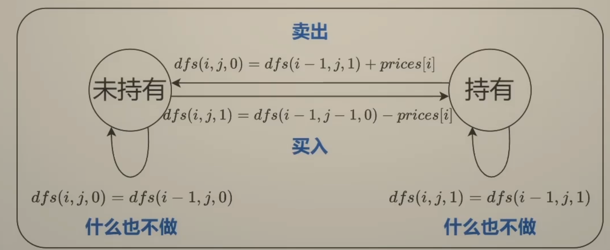

# 状态机DP

买卖股票问题，经典的状态机动态规划题目，主要有两种类型

1. 不限制交易次数
2. 限制交易次数：至多交易k次
    - 变体：至少/恰好交易k次

## 122 买卖股票的最佳时机 II（不限制交易次数）

prices = [7,1,5,3,6,4]

- 启发思路：最后一天发生了什么？-> **倒着思考，由果索因**
    - 从第0天开始到第5天结束的利润 = 0天开始到第4天结束的利润 + 第五天的利润
        - 第五天的利润：无操作，买入，卖出 -> 0 或者 -4 或者 +4
        - 注意这里的卖出+4，是不考虑前几天买入时候的成本的，比如说倒数第二天6买入的，那么会记录在那天对应的买入操作的-6
        - 也就是**每天只考虑当天的金钱变动**，这样保证的完整性和正确性

关键词：1. 天数 2. 是否持有股票

- 子问题？到第i天结束，持有/未持有股票的最大利润
- 当前操作：
    - 从这张图可以看出来，状态转移有四种情况
- 下一个子问题？到第i-1天结束，持有/未持有股票的最大利润

所以可以定义dfs函数的语义

- dfs(i,0):表示第i天**结束**，未持有股票的最大利润
- dfs(i,1):表示第i天**结束**，持有股票的最大利润表示
- 由于i-1天的**结束**就是第i天的**开始**（这个等价转换关系经常使用，比较重要），dfs(i-1,·) 也表示到第i天**开始**时的最大利润

所以递归函数（状态转移）有

- dfs(i,0) = max(dfs(i-1, 0), dfs(i-1, 1) + prices[i])
- dfs(i,1) = max(dfs(i-1, 1), dfs(i-1, 0) - prices[i])

递归边界

- dfs(-1, 0) = 0    第0天**开始**未持有股票(i-1天的结束就是第i天的开始)
- dfs(-1, 1) = -inf 第0天**开始**不可能持有股票(i-1天的结束就是第i天的开始)

递归入口

- max(dfs(n-1, 0), dfs(n-1, 1)) = dfs(n-1, 0) 最后一天肯定是要手里股票卖出去了钱更多

翻译成递推

- f[i][0] = max(f[i-1][0], f[i-1][1] + prices[i])
- f[i][1] = max(f[i-1][1], f[i-1][0] - prices[i])

因为数组无法表示f[-1]，所以插入一个状态

- f[0][0] = 0, f[0][1] = -inf
- f[i+1][0] = max(f[i][0], f[i][1] + prices[i])
- f[i+1][1] = max(f[i][1], f[i][0] - prices[i])
- 答案为f[n][0];

### 309 买卖税票的最佳时机含冷冻期

类似于打家劫舍，如果选i，则i-1不能选，递归到i-2，这里有点同理，卖出股票，则第二天无法买入股票

- 那么对于i，直接从i-2进行状态转就行

### 714 买卖股票的最佳时机含手续费

- 相当于 - prices[i]的时候 多减去一个手续费，比较简单的变体

## 188 买卖股票的最佳时机 IV （至多交易k次）

至多交易k次，也就是说，可以不用完所有的交易机会，之前是不限制交易次数，添加了一个状态值j，用来表示至多完成j笔交易

- 定义 dfs(i,j,0) 表示 第i天**结束**时完成**至多**j笔交易，未持有股票的最大利润
- 定义 dfs(i,j,1) 表示 第i天**结束**时完成**至多**j笔交易，持有股票的最大利润
- 注意是：**至多**，不是恰好

所以递归函数

- dfs(i,j,0) = max(dfs(i-1,j,0), dfs(i-1,j,1) + prices[i])
- dfs(i,j,1) = max(dfs(i-1,j,1), dfs(i-1,j-1,0) - prices[i]) 
    - 我们把买入操作看作是进行了一次交易，所以卖出操作的地方j就不变了（另一种维护思路是将卖出操作看作是一次交易，在上面的位置维护j）

递归边界

- dfs(·,-1,·) = -inf  任何情况下，j都不应该为负
- dfs(-1,j,0) = 0     第0天**开始**未持有股票，利润为0
- dfs(-1,j,1) = -inf  第0天**开始**不可能持有股票

递归入口

- 同上面一样的理解，不需要取max，肯定是不持有股票更大：dfs(n-1,k,0)

翻译成递推

- f[i][j][0] = max(f[i-1][j][0], f[i-1][j][1] + prices[i])
- f[i][j][1] = max(f[i-1][j][1], f[i-1][j-1][0] - prices[i])

这样无法表示f[-1][·][·], f[·][-1][·]

- 所以 i和j对应维度都偏移 1，来维护索引为-1的情况，所以dfs(n-1, k, 0) -> f[n][k+1][0]

最终的递推式

- f[·][0][·] = -inf
- f[0][j][0] = 0  j >= 1  (第0天结束 = 第一天开始， 不持股票的利润，所以是0)
- f[0][j][1] = -inf  j >= 1 (第0天结束 = 第一天开始，持有股票的利润，刚开始不可能持有，所以负无穷)
- f[i+1][j][0] = max(f[i][j][0], f[i][j][1] + prices[i])
- f[i+1][j][1] = max(f[i][j][0], f[i][j][0] - prices[i])
- ans = f[n][k+1][0]

### 两个变形问题：恰好/至少交易k次

要怎么初始化？

- 恰好：f[0][1][0] = 0, 其余 = -inf
    - 注意前面塞了个状态，f[0][1]才是恰好完成0次的状态
- 至少：f[i][-1][·] 等价于 f[i][0][·]
    - 所以每个f[i]的最前面不需要插入状态
    - 「至少0次」等价于「可以无限次交易」
    - 所以f[i][0][·]就是无限次交易下的最大利润，转移方程也一样
    - 转移方程
        - f[0][0][0] = 0
        - f[i+1][0][0] = max(f[i][0][0], f[i][0][1] + prices[i])
        - f[i+1][0][1] = max(f[i][0][1], f[i][0][0] - prices[i])

###  k=1 121 买卖股票的最佳时机
###  k=2 123 买卖股票的最佳时机 III
