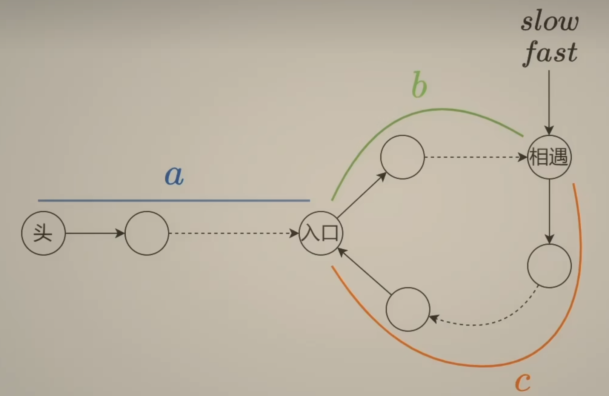
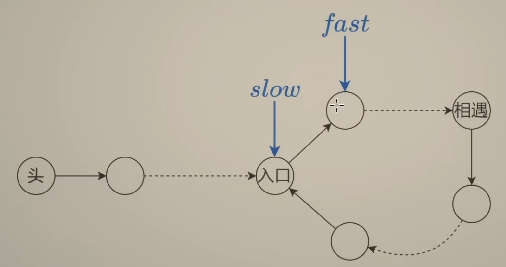

# Fast Slow Pointer

142.环形链表问题中 

- 首先有一个小结论：快慢指针相遇的时候，慢指针一定还没在环内走完一圈
- 所以有：
  - 环长 = b + c
  - 慢指针移动举例 = a + b
  - 快指针拆散举例 = a + b + k(b + c)
- 而快指针移动举例是慢指针两倍，有：
  - 2(a+b) = a+b+k(b+c) -> 2a+2b = a+b+b+c+(k-1)(b+c)
- 所以：a - c = (k-1)(b+c)
- 根据这个公式可以知道
  - slow接着走到入口，要走c步
  - head从头结点出发，走c步，入口前还剩 a-c 步
- 而 a-c = (k-1)(b+c)，也就是说，这个时候继续走，head和slow会在入口相遇

为什么，快慢指针相遇时，慢指针移动距离小于环长（也就是还没走完一整圈）

- 假如说，slow刚到环的入口，fast刚好在slow后一个节点
- 那么用相对速度分析，fast追上slow，需要走：环长 - 1 步，其余所有情况，fast要走的步数只会更少
- 而slow走的步数 < fast走的步数 = 环长 - 1 < 小于环长

所以可得，slow一定还没走够一圈（也就是环长）
