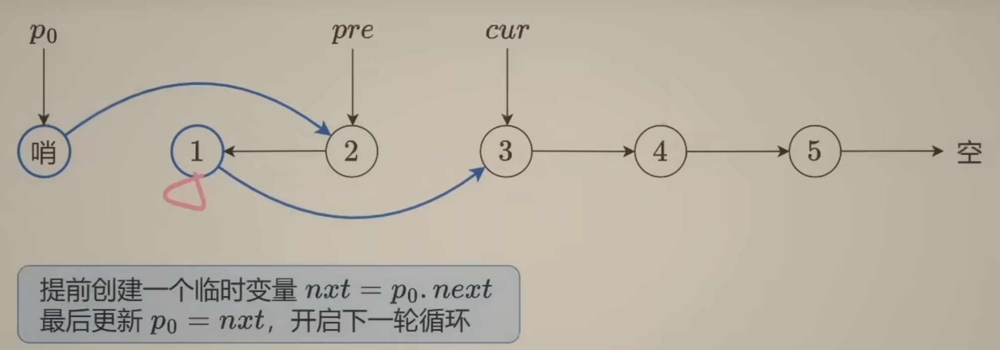

# Reverse Linked List

## 反转链表大一统

```c++
//翻转链表基础：区间 [a, b) 迭代形式
    ListNode* reverse(ListNode* a, ListNode* b) {
        ListNode* pre, *cur, *nxt;
        cur = a;
        pre = nullptr;
        while(cur != b) {
            nxt = cur->next;
            cur->next = pre;
            pre = cur;
            cur = nxt;
        return pre;
    }

//206 翻转整个链表 
    //[head, head+N) = [head, nullptr)
    //相当于 a = head, b = nullptr 调用 reverse(head, nullptr)
    //或者递归
    ListNode* reverseList(ListNode* head) {
        if(!head || !head->next) {
            return head;
        }
        auto newHead = reverseList(head->next);
        head->next->next = head;
        head->next = nullptr;
        return newHead;
    }

//翻转前k个 [head, head+n)
    ListNode* successor = nullptr;
    ListNode* reverseN(ListNode* head, int n) {
        if(n == 1) {
            successor = head->next;
            return head;
        }
        auto last = reverseN(head->next, n-1);
        head->next->next = head;
        head->next = successor;
        return last;
    }
//92 翻转指定范围 [head+a, head+b]
    ListNode* reverseBetween(ListNode* head, int left, int right) {
        if(left == 1) { 
            return reverseN(head, right);
        }
        head->next = reverseBetween(head->next ,left-1, right-1);
        return head;
    }
// 25 k个一组翻转
    ListNode* reverseKGroup(ListNode* head, int k) {
        if(!head) return nullptr;
        //[a, b)  翻转k个
        ListNode *a, *b;
        a = b = head;
        for(int i = 0; i < k; i++) {
            if(!b) return head; // 不够k个
            b = b->next;
        }
        ListNode* newHead = reverse(a, b);
        a->next = reverseKGroup(b, k);
        return newHead;
    }
// 24 两两交换 = 两个一组翻转链表
```



