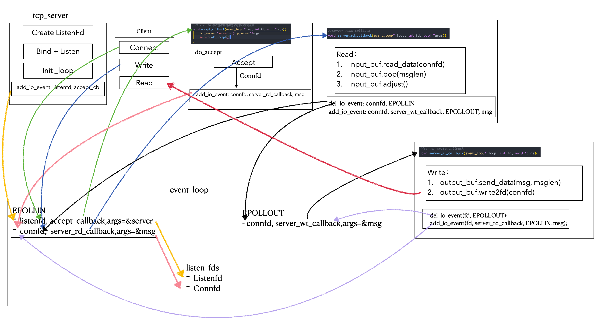

# Lars
> 刘丹冰老师[Lars](https://github.com/aceld/Lars) 负载均衡远程服务调度系统的逐章节实现
> 
> 多线程部分内容改用C++11标准库实现
> 
> 注：仅供学习理解使用，如有任何问题，请联系:haze188@qq.com

## Lars Reactor v0.1-v0.12: 基于Reactor模式的LinuxC++服务器

### Lars Reactor v0.1

- 代码：[Lars_reactor_0.1](https://github.com/Hz188/Lars/tree/master/Lars_Reactor/lars_reactor_0.1)
- Server: 单线程Accept + 无I/O复用
- Client: 无实际客户端，`nc 127.0.0.1 7777`，得到回复，不支持写

### Lars Reactor v0.2

- 代码：[Lars_reactor_0.2](https://github.com/Hz188/Lars/tree/master/Lars_Reactor/lars_reactor_0.2)
- Server: 单线程Accept + 引入io_buf(buf_pool) + 无I/O复用
- Client: 无实际客户端，`nc 127.0.0.1 7777`，支持写入消息，然后回显消息

### Lars Reactor v0.3

- 代码：[Lars_reactor_0.3](https://github.com/Hz188/Lars/tree/master/Lars_Reactor/lars_reactor_0.3)
- Server: 单线程Accept + 引入io_buf(buf_pool) + server侧I/O复用
    1. 服务器构造函数时候，将`listenFd`添加进`epoll`实例监听：`accept_callback、EPOLLIN`
    2. 客户端connect时，触发`listenfd`的`EPOLLIN`事件，回调`accept_callback`，建立连接得到`connfd`
    3. 加入监听：`server_rd_callback、EPOLLIN`
    4. 客户端write时，触发`connfd`的`EPOLLIN`事件，回调`server_rd_callback`，删除`connfd`的`EOPLLIN`事件，加入监听：`server_wt_callback、EPOLLOUT`
    5. 然后`epoll_wait`得到`EPOLLOUT`事件触发，回调`server_wt_callback`，回显消息，之后回到`3.`不断循环往复
        - 这里要注意一下EPOLLOUT事件的触发条件：套接字的发送缓冲区是空的，并且可以立即写入数据，`epoll_ctl`这个时候将套接字添加进入`epoll实例`时候，`EPOLLOUT`时间会立即触发
- Client: 无实际客户端，`nc 127.0.0.1 7777`，支持写入消息，然后回显消息

### Lars Reactor v0.4

- 代码：[Lars_reactor_0.4](https://github.com/Hz188/Lars/tree/master/Lars_Reactor/lars_reactor_0.4)
- Server: 单线程Accept + 引入io_buf(buf_pool) + server侧I/O复用
    - tcp_conn链接设置:禁止做读写缓存，降低小包延迟
        - `setsockopt(_connfd, IPPROTO_TCP, TCP_NODELAY, &op, sizeof(op));`
    - Message消息封装：TLV格式解决粘包
- Client: 无法使用`nc 127.0.0.1 7777`做测试了，因为只能接受TLV格式的报文，需要自己实现客户端

### Lars Reactor v0.4_impl_client

- 代码：[Lars_reactor_0.4_impl_cli](https://github.com/Hz188/Lars/tree/master/Lars_Reactor/lars_reactor_0.4_impl_cli)
- Server: 单线程Accept + io_buf(buf_pool) + I/O复用event_loop + tcp_conn封装
- Client: Connect + io_buf(buf_pool) + I/O复用event_loop

### Lars Reactor v0.5
> 这里通信架构同上，没有变化
- 代码：[Lars_reactor_0.5](https://github.com/Hz188/Lars/tree/master/Lars_Reactor/lars_reactor_0.5)
- Server: 单线程Accept + 缓冲池 + I/O复用event_loop事件机制 + tcp_conn封装 + 链接管理
    - 链接管理：增加连接、减少连接、获得当前连接数
        - 维护`tcp_conn*`数组，存储所有在线连接信息
        - 配置文件限制最大连接数    
    - tcp_server在do_accept的时候，会根据最大连接数设置，约束链接数量
        - 链接数量超过则返回信息，不建立链接
        - 若建立链接，维护相关信息（增加连接数）
        - tcp_conn销毁时，维护相关信息（减少连接数）
- Client: Connect + io_buf(buf_pool) + I/O复用event_loop


### Lars Reactor v0.6
> 这里通信架构同上，没有变化


- 代码：[Lars_reactor_0.6](https://github.com/Hz188/Lars/tree/master/Lars_Reactor/lars_reactor_0.6)
- Server: 单线程Accept + 缓冲池 + I/O复用event_loop事件机制 + tcp_conn封装 + 链接管理 + 消息业务路由分发
    - 在解决粘包问题时候，我们通过TLV结构封装了Message，其中有一个msgid字段
    - 在服务器接收到客户端消息的时候，会根据msgid进行路由，将消息分发到对应业务回调函数
- Client: Connect + io_buf(buf_pool) + I/O复用event_loop

### Lars Reactor v0.7
> 这里通信架构同上，没有变化


- 代码：[Lars_reactor_0.7](https://github.com/Hz188/Lars/tree/master/Lars_Reactor/lars_reactor_0.7)
- Server: 单线程Accept + 缓冲池 + I/O复用event_loop事件机制 + tcp_conn封装 + 链接管理 + 消息业务路由分发 + Hook机制
    - 所谓Hook函数：就是服务端创建链接和销毁链接的时候，即创建前和销毁后，执行对应的回调函数
- Client: Connect + io_buf(buf_pool) + I/O复用event_loop
    - 客户端也同理，在connect()成功的时候，会执行创建前回调，在clean_conn()时会执行销毁的回调


### Lars Reactor v0.8


- 代码：[Lars_reactor_0.8](https://github.com/Hz188/Lars/tree/master/Lars_Reactor/lars_reactor_0.8)
- Server: 单线程Accept + 缓冲池 + I/O复用event_loop事件机制 + tcp_conn封装 + 链接管理 + 消息业务路由分发 + Hook机制 + 线程池 + 消息任务队列
    - Server端实现了线程池
    - 线程池中每个线程
        - 对应了一个消息任务队列thread_queue
        - 同时对应一个event_loop事件管理机制
        - 这个loop管理这个线程的所有连接套接字`connfd`的I/O操作 
- Client: Connect + io_buf(buf_pool) + I/O复用event_loop

### Lars Reactor v0.9


- 代码：[Lars_reactor_0.9](https://github.com/Hz188/Lars/tree/master/Lars_Reactor/lars_reactor_0.9)
- 实现了Server侧读取配置文件：配置类是单例模式
```cpp
    //加载配置文件
    config_file::setPath("./serv.conf");
    std::string ip = config_file::instance()->GetString("reactor", "ip", "0.0.0.0");
    short port = config_file::instance()->GetNumber("reactor", "port", 8888);
```

### Lars Reactor v0.10

- 代码：[Lars_reactor_0.10](https://github.com/Hz188/Lars/tree/master/Lars_Reactor/lars_reactor_0.10)
- 主要是支持了UDP通信方式，但没有线程池、只有单线程处理方式